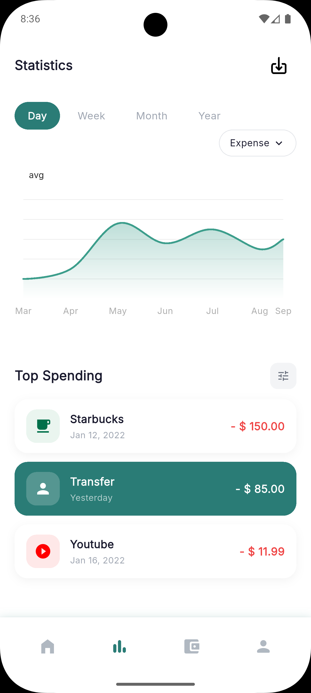
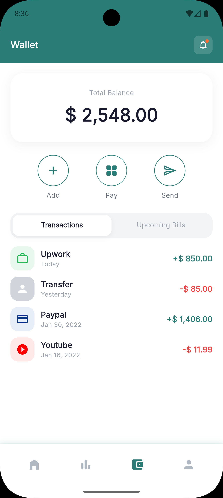
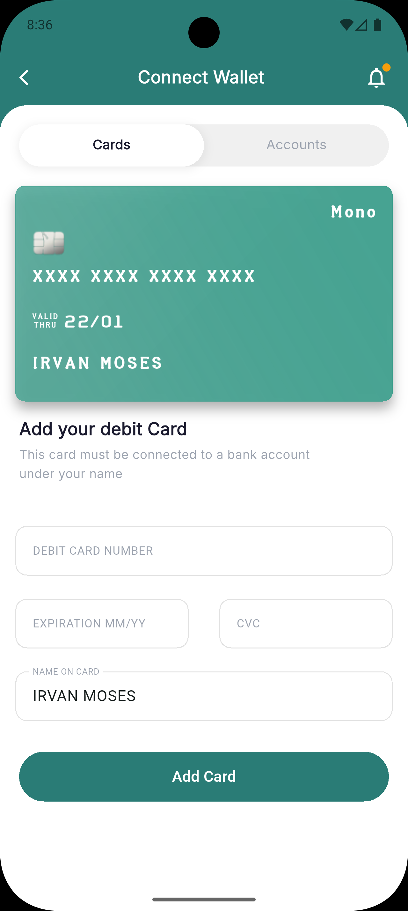

# Expence Tracker

Demo Flutter app for expense tracking with a ready-to-use UI flow:
`Splash -> Onboarding -> Main Navigator (Home / Statistics / Wallet / Profile)`.

## Features

- Splash and onboarding screens.
- Bottom navigation with 4 tabs.
- Home screen with balance, transactions, and quick navigation to `Add Expense`.
- Add expense screen with numeric keypad and date picker.
- Statistics screen with chart (`fl_chart`) and Top Spending section.
- Wallet with `Transactions` tab and transaction details screens.
- Wallet with `Upcoming Bills` tab and payment action.
- Separate payment flow: `Connect Wallet -> Bill Details -> Bill Payment -> Bill Payment Success`.

## Tech Stack

- Flutter (Dart `^3.11.0` from `pubspec.yaml`)
- `fl_chart` (charts)
- `flutter_svg` (SVG icons)
- `flutter_credit_card` (credit card form UI)
- `google_fonts`
- `another_flutter_splash_screen`

## Screenshots

|                   Onboarding                    |                   Dashboard                   |                   Statistics                    |
| :---------------------------------------------: | :-------------------------------------------: | :---------------------------------------------: |
|  |  |  |

|                     Wallet                     |                     Connect Wallet                      |                     Profile                      |
| :--------------------------------------------: | :-----------------------------------------------------: | :----------------------------------------------: |
|  |  |  |

## Project Structure

```text
lib/
  core/
    colors/
    enums/
    models/
  screens/
  widgets/
  main.dart
  main_navigator.dart
assets/
  images/
  icons/
  screeshots/
```

## Quick Start

1. Install Flutter SDK.
2. Run in the project root:

```bash
flutter pub get
flutter run
```
